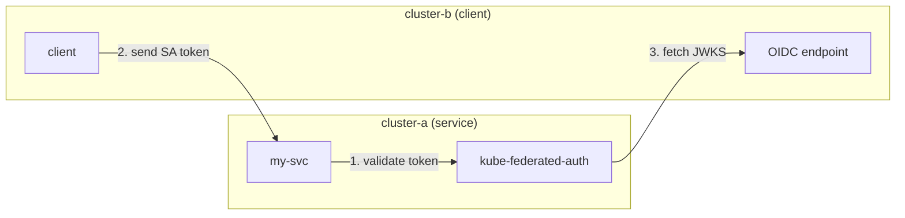

# kube-federated-auth

Federated ServiceAccount authentication across Kubernetes clusters.

Validate ServiceAccount tokens from multiple Kubernetes clusters using their OIDC endpoints. Enables cross-cluster workload authentication without service meshes or additional identity infrastructure.

## How It Works



1. Client workload sends its ServiceAccount token to your service
2. Your service calls kube-federated-auth `/validate` endpoint
3. kube-federated-auth validates the JWT against the cluster's OIDC/JWKS
4. Your service authorizes based on returned claims

## Quick Start

```bash
# Run locally
go run ./cmd/server --config=config/clusters.yaml

# Or with Docker
docker run -v $(pwd)/config:/etc/kube-federated-auth ghcr.io/rophy/kube-federated-auth
```

## Configuration

```yaml
# config/clusters.yaml
renewal:
  interval: "1h"          # How often to check for renewal
  token_duration: "168h"  # Requested token TTL (7 days)
  renew_before: "48h"     # Renew when <48h remaining

clusters:
  # Local cluster (uses in-cluster OIDC)
  cluster-a:
    issuer: "https://kubernetes.default.svc.cluster.local"

  # EKS cluster (public OIDC endpoint)
  eks-prod:
    issuer: "https://oidc.eks.us-west-2.amazonaws.com/id/EXAMPLE"

  # Remote cluster with private OIDC (requires credentials)
  cluster-b:
    issuer: "https://kubernetes.default.svc.cluster.local"
    api_server: "https://192.168.1.100:6443"
    ca_cert: "/etc/kube-federated-auth/certs/cluster-b-ca.crt"
    token_path: "/etc/kube-federated-auth/certs/cluster-b-token"
```

## API

### POST /validate

Validate a ServiceAccount token.

```bash
curl -X POST http://localhost:8080/validate \
  -H "Content-Type: application/json" \
  -d '{"token": "<sa-token>", "cluster": "cluster-b"}'
```

**Status Codes:**

| Status | Error | Description |
|--------|-------|-------------|
| `200` | - | Token valid |
| `400` | `cluster_not_found` | Unknown cluster |
| `400` | - | Invalid JSON or missing fields |
| `401` | `token_expired` | Token has expired |
| `401` | `invalid_signature` | Signature verification failed |
| `401` | `invalid_token` | Other token errors |
| `500` | `oidc_discovery_failed` | Cannot fetch OIDC config |
| `500` | `jwks_fetch_failed` | Cannot fetch JWKS |

Success response:
```json
{
  "cluster": "cluster-b",
  "iss": "https://kubernetes.default.svc.cluster.local",
  "sub": "system:serviceaccount:default:my-app",
  "aud": ["https://kubernetes.default.svc.cluster.local"],
  "exp": 1766323600,
  "iat": 1765718800,
  "kubernetes.io": {
    "namespace": "default",
    "serviceaccount": {
      "name": "my-app",
      "uid": "..."
    }
  }
}
```

Error response:
```json
{
  "error": "invalid_signature",
  "message": "Token signature verification failed"
}
```

### GET /clusters

List configured clusters and their status.

```json
{
  "clusters": [
    {
      "name": "cluster-a",
      "issuer": "https://kubernetes.default.svc.cluster.local",
      "token_status": {
        "expires_at": "2026-12-14T13:30:06Z",
        "expires_in": "8759h53m30s",
        "status": "valid"
      }
    },
    {
      "name": "cluster-b",
      "issuer": "https://kubernetes.default.svc.cluster.local",
      "api_server": "https://192.168.128.3:6443",
      "token_status": {
        "expires_at": "2025-12-21T13:26:40Z",
        "expires_in": "167h50m4s",
        "status": "valid"
      }
    }
  ]
}
```

### GET /health

```json
{"status":"ok"}
```

## Environment Variables

| Variable | Default | Description |
|----------|---------|-------------|
| `CONFIG_PATH` | `config/clusters.yaml` | Path to config file |
| `PORT` | `8080` | Server port |
| `NAMESPACE` | `kube-federated-auth` | Namespace for credential secret |
| `SECRET_NAME` | `kube-federated-auth` | Secret name for credentials |

## License

MIT
