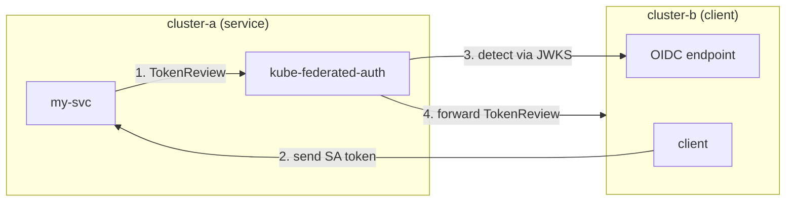

# kube-federated-auth

Federated ServiceAccount authentication across Kubernetes clusters.

Validate ServiceAccount tokens from multiple Kubernetes clusters using their OIDC endpoints. Enables cross-cluster workload authentication without service meshes or additional identity infrastructure.

## How It Works



1. Client workload sends its ServiceAccount token to your service
2. Your service calls kube-federated-auth using standard Kubernetes TokenReview API
3. kube-federated-auth detects the source cluster by verifying the JWT signature against cached JWKS (local, no token leakage)
4. kube-federated-auth forwards the TokenReview to the detected cluster for authoritative validation (revocation checks, bound object validation)

## Quick Start

```bash
# Run locally
go run ./cmd/server --config=config/clusters.yaml

# Or with Docker
docker run -v $(pwd)/config:/etc/kube-federated-auth ghcr.io/rophy/kube-federated-auth
```

## Configuration

```yaml
# config/clusters.yaml
renewal:
  interval: "1h"          # How often to check for renewal
  token_duration: "168h"  # Requested token TTL (7 days)
  renew_before: "48h"     # Renew when <48h remaining

clusters:
  # EKS cluster (public OIDC endpoint, no credentials needed)
  eks-prod:
    issuer: "https://oidc.eks.us-west-2.amazonaws.com/id/EXAMPLE"

  # Remote cluster with private OIDC (requires credentials)
  cluster-b:
    issuer: "https://kubernetes.default.svc.cluster.local"
    api_server: "https://192.168.1.100:6443"
    ca_cert: "/etc/kube-federated-auth/certs/cluster-b-ca.crt"
    token_path: "/etc/kube-federated-auth/certs/cluster-b-token"
```

## API

### POST /apis/authentication.k8s.io/v1/tokenreviews

Standard Kubernetes TokenReview API. The source cluster is automatically detected via JWKS signature verification — no cluster-specific routing needed.

```bash
curl -X POST http://kube-federated-auth:8080/apis/authentication.k8s.io/v1/tokenreviews \
  -H "Content-Type: application/json" \
  -d '{
    "apiVersion": "authentication.k8s.io/v1",
    "kind": "TokenReview",
    "spec": {
      "token": "<sa-token>"
    }
  }'
```

**Success response:**

```json
{
  "apiVersion": "authentication.k8s.io/v1",
  "kind": "TokenReview",
  "status": {
    "authenticated": true,
    "user": {
      "username": "system:serviceaccount:default:my-app",
      "uid": "abc-123",
      "groups": [
        "system:serviceaccounts",
        "system:serviceaccounts:default",
        "system:authenticated"
      ],
      "extra": {
        "authentication.kubernetes.io/cluster-name": ["cluster-b"]
      }
    }
  }
}
```

The `extra["authentication.kubernetes.io/cluster-name"]` field indicates which cluster the token was validated against.

**Error response:**

```json
{
  "apiVersion": "authentication.k8s.io/v1",
  "kind": "TokenReview",
  "status": {
    "authenticated": false,
    "error": "token not valid for any configured cluster"
  }
}
```

### GET /clusters

List configured clusters and their credential status.

```json
{
  "clusters": [
    {
      "name": "eks-prod",
      "issuer": "https://oidc.eks.us-west-2.amazonaws.com/id/EXAMPLE"
    },
    {
      "name": "cluster-b",
      "issuer": "https://kubernetes.default.svc.cluster.local",
      "api_server": "https://192.168.1.100:6443",
      "token_status": {
        "expires_at": "2025-12-21T13:26:40Z",
        "expires_in": "167h50m4s",
        "status": "valid"
      }
    }
  ]
}
```

### GET /health

```json
{"status":"ok"}
```

## kube-auth-proxy

See [kube-auth-proxy](https://github.com/rophy/kube-auth-proxy) — a standalone auth proxy for Kubernetes ServiceAccount tokens that works with kube-federated-auth or directly against the Kubernetes API.

## Environment Variables

### kube-federated-auth server

| Variable | Default | Description |
|----------|---------|-------------|
| `CONFIG_PATH` | `config/clusters.yaml` | Path to config file |
| `PORT` | `8080` | Server port |
| `NAMESPACE` | `kube-federated-auth` | Namespace for credential secret |
| `SECRET_NAME` | `kube-federated-auth` | Secret name for credentials |

## License

MIT
